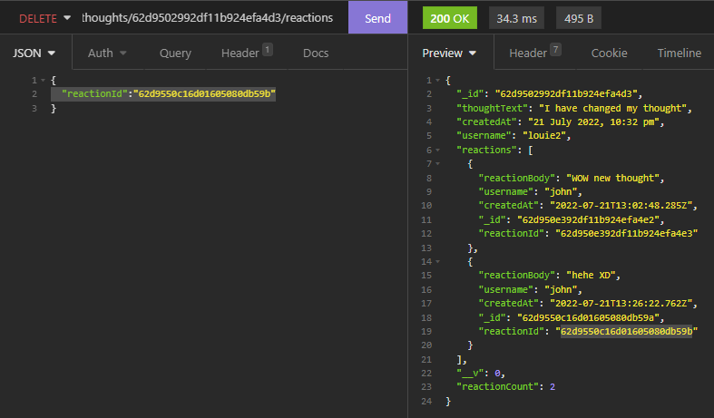

# Social-Network-API
This project is a demostration of a backend for a soical network web application user that they can share their thought, react to friend's thoughts, and create a friend list and create a friend list. Using technologies like express.js, Mongoose.

## Table of Content

  - [Feature](#feature)
  - [Installation](#installation)
  - [Usage](#usage)
  - [Credits](#credits)
  - [License](#license)

## Feature

Serves as a social network backend API service

## Installation

Step 1: Clone the repo (HTTPS: `git clone https://github.com/louieiply/Social-Network-API` or SSH: `git@github.com:louieiply/Social-Network-API.git`)

Step 2: Install Node.js

Step 3: npm i (install all components from the package.json)

## Usage

### Video

Demonstration link [Click me](https://youtu.be/8pbZAJLkJhU)

### Screenshot

Get All Users api/users

Post a User api/users

Get a User api/users/:userId

Put a User api/users/:userId

Delete a User api/users/:userId

Post a friend to User api/users/:userId/friends/:friendId

Delete a friend from User api/users/:userId/friends/:friendId

Get All Thoughts api/thoughts

Post a Thought api/thoughts

Get a Thought api/thoughts/:thoughtId

Put a Thought api/thoughts/:thoughtId

Delete a Thought api/thoughts/:thoughtId

Post Reaction api/thoughts/:thoughtId/reactions

Delete a Reaction api/thoughts/:thoughtId/reactions/:reactionId

## Credits

Github, express.js(npm), mysql2(npm), sequelize(npm), dotenv(npm)

## License
[MIT License - Copyright (c) 2022 Louie Ip](./LICENSE)
